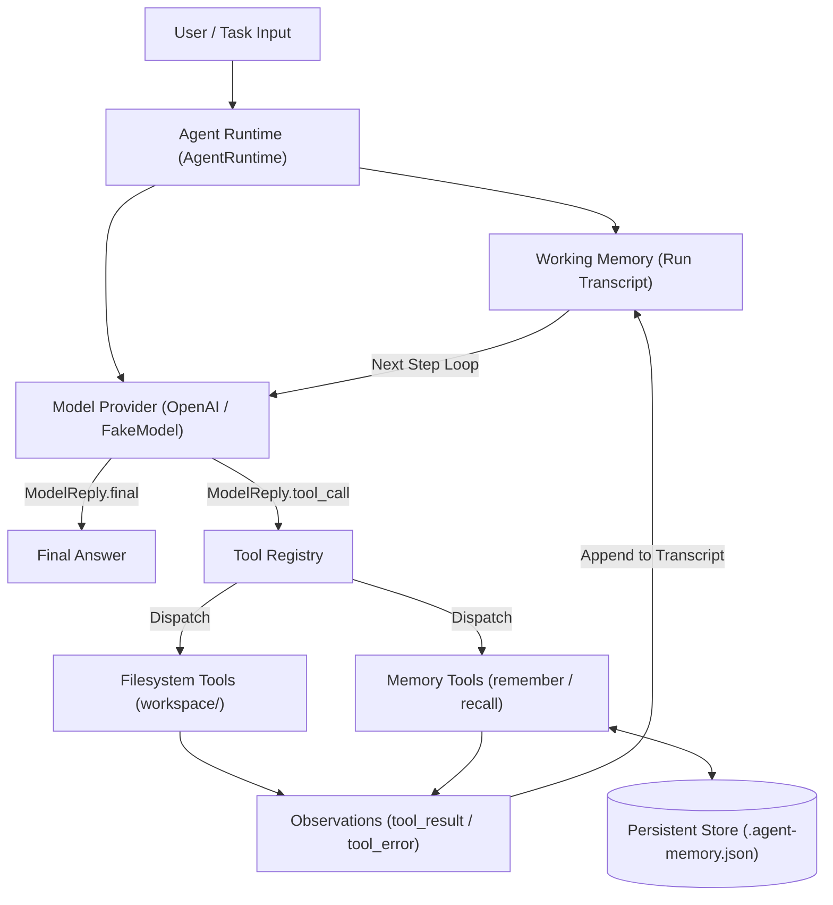

# Minimal Agent Runtime

[](https://minimal-agent-runtime.vercel.app)
[](https://30munh.github.io/Minimal-Agent-Runtime/)
[](https://python.org)
[](tests/)

A lightweight, zero-dependency Python agent runtime featuring a real orchestration loop, generic tool calling, persistent JSON memory, execution tracing, and deterministic testing.

---

## 📌 Project Overview

**Minimal Agent Runtime** provides a clean, modular reference implementation of an autonomous AI agent control loop. Designed for local execution, deterministic testing, and cloud LLM integration, it demonstrates how autonomous agents process user tasks, dispatch schema-validated tools, maintain state across runs, and record structured execution logs.

---

## 🎯 Assignment Goal

The goal of this project is to build a minimal but complete agent runtime from scratch without heavy external agent frameworks (e.g. LangChain, CrewAI). The runtime is designed to:
- Be fully testable offline without network access or API keys.
- Enforce strict sandboxing boundaries (workspace-scoped file operations).
- Provide explicit cross-session memory mechanisms rather than implicit prompt dumps.
- Include rich human-readable and machine-readable execution tracing.

---

## ✨ Features

- **🔄 Orchestration Loop**: Iterative think-act-observe loop bounded by `max_steps` with graceful error recovery.
- **🛠️ Generic Tool Interface**: Schema-based tool registration decoupled from runtime logic.
- **📁 Sandboxed Filesystem Tools**: Restricted to `workspace/` (`list_files`, `read_file`, `write_file`, `search_files`).
- **💾 Dual Memory System**: Ephemeral in-memory working transcript + persistent JSON key-value store (`remember`, `recall`).
- **📊 Observability & Tracing**: Real-time console tracing, per-tool millisecond timing, and non-sensitive JSON run logs (`logs/run-XXX.json`).
- **🧪 100% Offline Testability**: Complete 19-unit test suite executing in under 30ms using `FakeModel`.

---

## 🏗️ Architecture



---

## 📂 Repository Layout

```text
.
├── agent_runtime/             # Core Python package
│   ├── __init__.py            # Package exports
│   ├── cli.py                 # CLI entrypoint & .env auto-loader
│   ├── filesystem_tools.py    # Sandboxed workspace tools
│   ├── memory.py              # JsonMemory persistent engine
│   ├── memory_tools.py        # Explicit remember & recall tools
│   ├── models.py              # ModelProvider protocol & OpenAI client
│   ├── observability.py       # Trace renderer & JSON log recorder
│   ├── runtime.py             # Main AgentRuntime orchestration loop
│   └── tools.py               # Generic Tool class & schema wrapper
├── docs/                      # Technical design documents
│   └── agent-runtime-design.md# Core architecture & design note
├── docs-site/                 # Static documentation portal (Vercel & GitHub Pages)
│   ├── index.html             # Submission portal homepage
│   ├── architecture.html      # Architecture & flow diagrams
│   ├── verification.html      # Detailed verification matrix
│   ├── design.html            # Design note summary
│   ├── usage.html             # Comprehensive usage guide
│   └── trace.html            # Observability & log guide
├── examples/                  # Offline & online execution examples
│   ├── multi_step_task.py     # Offline multi-step task demo
│   ├── offline_todo_report_demo.py # Workspace scanner & report demo
│   ├── offline_trace_demo.py  # Tracing & log export demo
│   └── seed_workspace.py     # Workspace seeding utility
├── tests/                     # Deterministic unit test suite
│   ├── test_filesystem_tools.py
│   ├── test_memory.py
│   ├── test_memory_tools.py
│   ├── test_observability.py
│   ├── test_openai_provider.py
│   ├── test_runtime.py
│   └── test_tools.py
├── .env                       # Local environment file (API Key)
├── .gitignore                 # Git ignore rules
├── DELIVERABLES.md            # Requirement traceability matrix
├── PROJECT_SUMMARY.md         # Executive one-page summary
├── SUBMISSION.md              # Reviewer submission guide
├── pyproject.toml             # Python package configuration
└── vercel.json                # Vercel deployment configuration
```

---

## ⚡ Quick Start

No external dependencies are required for offline verification:

```bash
# Clone repository
git clone https://github.com/30MUNH/Minimal-Agent-Runtime.git
cd Minimal-Agent-Runtime

# Run unit tests
python3 -m unittest discover -s tests -v
```

---

## 🧪 Offline Verification

Execute all offline demos without network access:

```bash
# 1. Run multi-step task & memory demo
python3 examples/multi_step_task.py

# 2. Run workspace TODO scanner & report generator
python3 examples/offline_todo_report_demo.py

# 3. Run execution trace & JSON logger demo
python3 examples/offline_trace_demo.py
```

---

## 🌐 Live Verification (OpenAI API)

For live model execution using OpenAI:

```bash
# 1. Install optional OpenAI SDK
python3 -m pip install -e ".[openai]"

# 2. Add API key to .env file
echo "OPENAI_API_KEY=sk-proj-your-key" > .env

# 3. Seed workspace files & run live CLI task
python3 examples/seed_workspace.py
python3 -m agent_runtime.cli --trace --save-trace --verbose \
  "Inspect the files in the workspace, find all TODO items, create a concise report at todo-report.md, and remember where the report was saved."
```

---

## 📊 Execution Trace & JSON Logs

Add `--trace` to print step-by-step execution details, and `--save-trace` to output audit logs under `logs/`:

```text
STEP 1
Model invocation

STEP 2
Model requested tool: search_files
Arguments: {"query": "TODO"}

STEP 3
Executed tool: search_files (Status: success, Duration: 1 ms)

Execution Summary
Steps: 4 | Tools: 1 ok | Total runtime: 3 ms
Saved trace: logs/run-001.json
```

---

## ⚠️ Limitations

- **Bounded Execution**: Bounded by `max_steps` (default 8/12) to prevent infinite loops.
- **Single Threaded**: Tool execution runs sequentially within a single thread.
- **Workspace Scope**: Filesystem operations are strictly sandboxed inside `workspace/`.

---

## 🔮 Future Improvements

- Parallel tool call execution for independent tool requests.
- Additional model providers (Anthropic Claude, Ollama local LLMs).
- Token usage tracking and cost estimation metrics in observability logs.

---

## 📄 License & Submission Notice

Built for reviewer submission. View the live [Documentation Site](https://minimal-agent-runtime.vercel.app) or read [`SUBMISSION.md`](SUBMISSION.md) for details.
